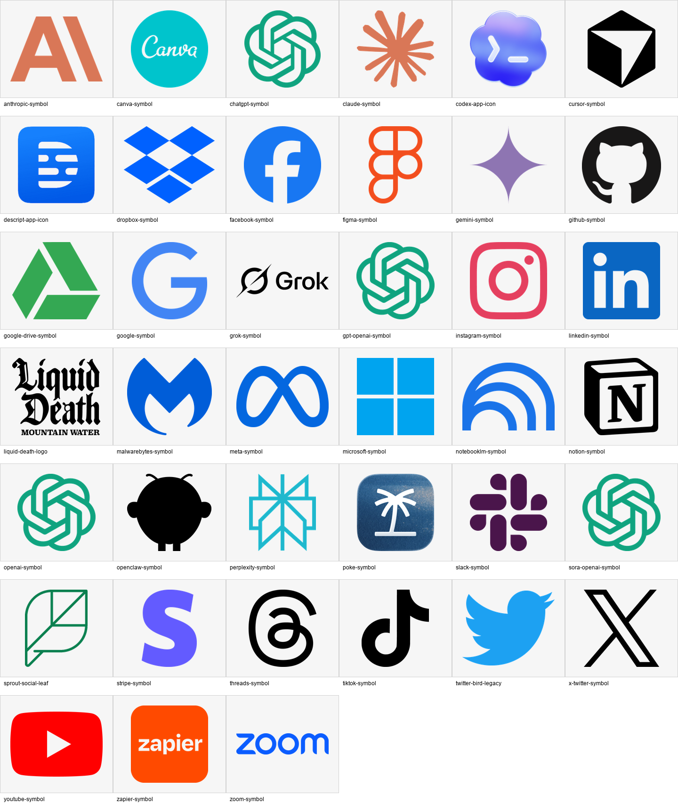
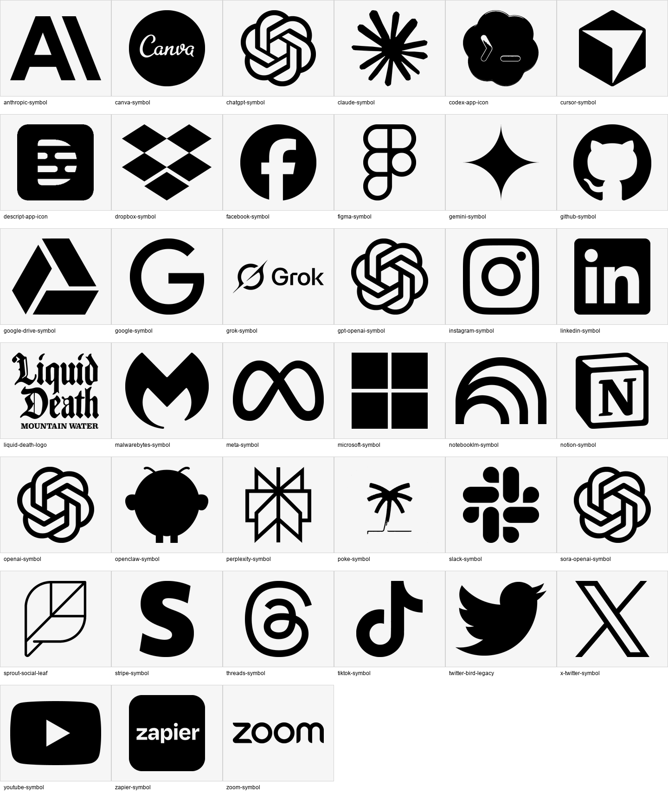
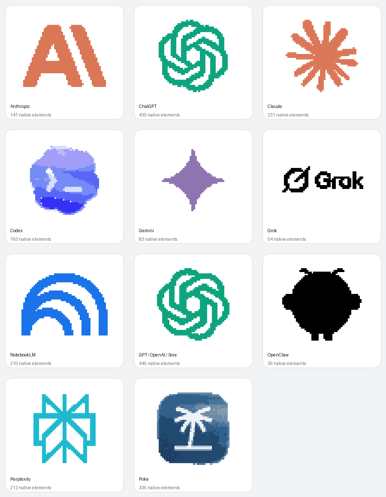

# Insta360 Mic Pro Logos

Mic Pro-ready logo wallpapers for the Insta360 Mic Pro transmitter E-Ink display.

The files in this repo are already sized for the device:

- PNG
- 240 x 208 px
- Transparent background
- Color and high-contrast variants

This is meant to be the easy download kit for creators who want their mic display to match the company, platform, or tool they are talking about.

## Download

Start here:

- [Download all color logos](downloads/insta360-mic-pro-logos-color.zip)
- [Download all high-contrast logos](downloads/insta360-mic-pro-logos-high-contrast.zip)
- [Download everything](downloads/insta360-mic-pro-logos-all.zip)
- [Download the AI Tools Excalidraw library](downloads/insta360-mic-pro-ai-tools.excalidrawlib)

Browse individual logos in [`logos/`](logos/), or use the static browser in [`site/`](site/).

The Excalidraw library contains 11 distinct AI-tool marks as grouped, portable
native elements. Open the library panel in Excalidraw, choose **Load library
from file**, and select the downloaded `.excalidrawlib`. See
[`docs/excalidraw-library.md`](docs/excalidraw-library.md) for testing,
rebuilding, and public-submission notes.

## Preview

Color set:

High-contrast set:

Excalidraw AI Tools library:

## Which Folder Should I Use?

Use **color** when you want the brand feel.

Use **high contrast** when you want the safest, most readable version on the small E-Ink screen.

The Mic Pro screen supports color, but it is still E-Ink. Insta360 says the transmitter has a 1.22 in 6-color E-Ink screen at 240 x 208 and 197 PPI, and their wallpaper docs warn that some colors may appear less saturated or not fully match the original image.

## How To Load A Logo

1. Download the logo PNG you want.
2. Save it to your phone album.
3. Open the Insta360 app.
4. Go to the Mic Pro E-Ink/custom wallpaper area.
5. Upload the PNG from your album.

See [docs/how-to-load.md](docs/how-to-load.md) for the longer version.

## Contribute

You can help in two ways:

- Request a logo with a GitHub issue.
- Add a logo with a pull request.

Every submitted logo needs:

- Color PNG at 240 x 208 px
- High-contrast PNG at 240 x 208 px
- Transparent background
- Source link
- Clear file name

See [CONTRIBUTING.md](CONTRIBUTING.md).

## Legal And Trademark Note

The code, documentation, metadata, and site structure in this repo are MIT licensed.

The logo marks themselves are not owned by this repo. They remain trademarks and/or copyrighted assets of their respective owners. This project adapts publicly available marks into Mic Pro-ready wallpaper files and does not imply endorsement by Insta360 or any brand owner.

See [TRADEMARKS.md](TRADEMARKS.md).

## Sources

- Insta360 Mic Pro hardware specs: <https://onlinemanual.insta360.com/micpro/en-us/specs/hardware>
- Insta360 E-Ink wallpaper docs: <https://onlinemanual.insta360.com/micpro/en-us/operation-tutorial/appearance/e-ink>
- Catalog: [`catalog.json`](catalog.json)
